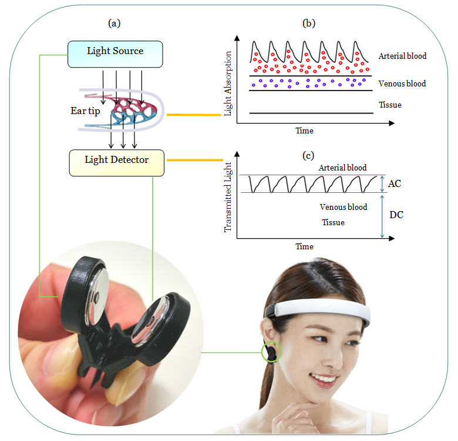
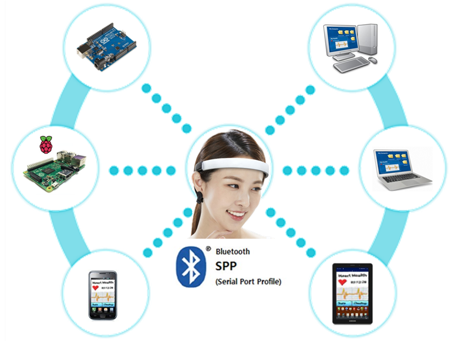

### Heart beat. Optical Measuring
- The light from the light source (fig.a) is absorbed by tissue, venous blood and arterial blood.
- The light absorption is in proportion to arterial blood volume (fig.b).
- The output of the light detector shows the blood volume changes synchronized with heart beats (fig.c).
- Usually, the measured AC component is named by pulse wave or PPG (Photo Plethysmo Gram).

### Bluetooth Connection
- Bluetooth Profile : SPP(Serial Port Profile)
- It's easy to program with host's serial port access. 

## Full Documentation : http://laxtha.net/neuronicle-FX2

